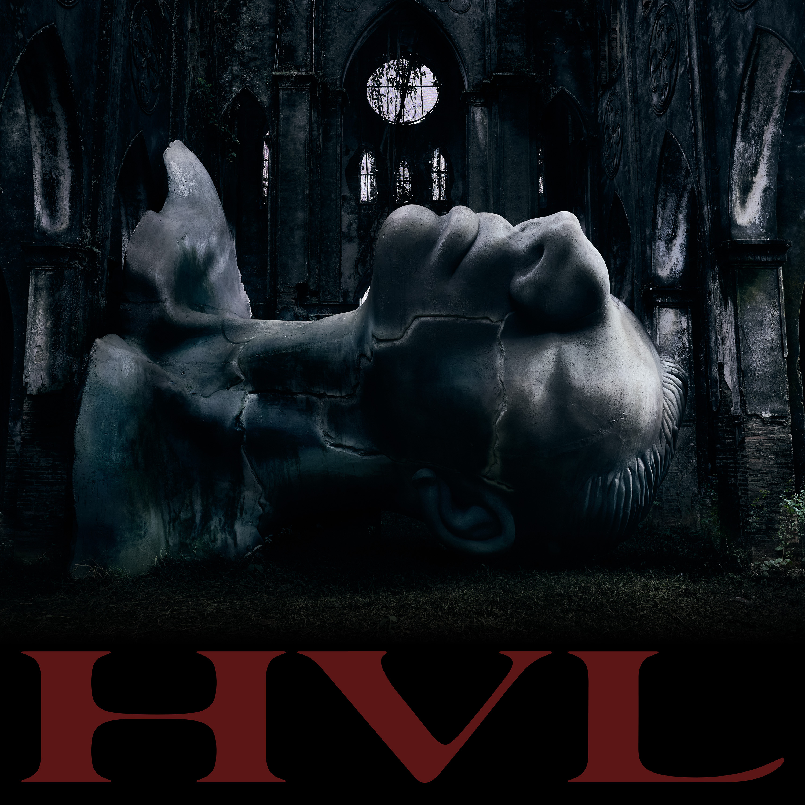

<div align="center">



# 💿 HVL — RPT MCK (Web Music Player)

Ứng dụng web nghe nhạc trực tuyến hỗ trợ trọn vẹn **Full Album HVL (Hướng Về Long)** gồm 30 ca khúc của nghệ sĩ **RPT MCK (Nghiêm Vũ Hoàng Long)** — bao gồm đầy đủ cả những ca khúc và phiên bản đã từng bị yêu cầu gỡ bỏ hoặc hạn chế trên các nền tảng mạng xã hội và dịch vụ nghe nhạc trực tuyến.

Giao diện ứng dụng được thiết kế tối giản mang phong cách dark brutalist lấy cảm hứng từ nhận diện thương hiệu **[N0L4B3L](https://n0l4b3l.com/)**.

🌐 **Trải nghiệm trực tuyến**: [https://hvl-albumleak.vercel.app](https://hvl-albumleak.vercel.app)

</div>

---

## 📖 Giới Thiệu Về Album & Trình Phát

- **Album HVL**: Album phòng thu gồm đầy đủ 30 bài hát với chất lượng âm thanh nguyên bản, lưu giữ trọn vẹn toàn bộ các bản nhạc của MCK và các nghệ sĩ hợp tác (Obito, Tage, marzuz, THANHDRAW, Tùng Dương, RPT Orijinn, AAP Ướt Mi,...), bao gồm cả những bài hát đã không còn xuất hiện trên các nền tảng phát hành trực tuyến chính thống.
- **Trình Phát Web**: Cung cấp trải nghiệm nghe nhạc Lossless mượt mà, đồng bộ lời bài hát chạy theo thời gian thực (Synced Lyrics), tích hợp trình xem các Music Video (MV) chính thức của album và hỗ trợ tối ưu giao diện trên cả máy tính lẫn điện thoại di động.

---

## 🎮 Hướng Dẫn Sử Dụng & Phím Tắt

- **Nghe nhạc & Tua lời**: Lời bài hát tự động cuộn theo giai điệu đang phát. Bạn có thể bấm trực tiếp vào bất kỳ dòng lời bài hát nào để tua nhanh bài hát đến đoạn đó.
- **Trình xem MV**:
  - Nhấp chuột hoặc chạm 1 lần vào màn hình video để **Ẩn / Hiện** thanh điều khiển.
  - Nhấp đúp (Double-tap) nửa trái màn hình để lùi 10s hoặc nửa phải để tiến 10s.
  - Bấm nút danh sách MV ở góc trên để chọn nhanh 6 MV chính thức.
  - Khi MV kết thúc, hệ thống sẽ đếm ngược 3 giây và tự động chuyển sang MV tiếp theo.

### Bảng Phím Tắt

| Phím Tắt | Chức Năng |
| :--- | :--- |
| `Space` hoặc `K` | Phát / Tạm dừng bài hát / MV |
| `J` hoặc `Mũi tên Trái` | Tua lùi 10 giây (MV) / 5 giây (Nhạc) |
| `L` hoặc `Mũi tên Phải` | Tua tới 10 giây (MV) / 5 giây (Nhạc) |
| `Mũi tên Lên` / `Xuống` | Tăng / Giảm âm lượng 5% |
| `M` | Bật / Tắt tiếng (Mute) |
| `F` | Bật / Thoát chế độ toàn màn hình (Fullscreen) |
| `0` đến `9` | Nhảy nhanh đến 0% - 90% thời lượng video (MV Mode) |
| `Escape (Esc)` | Đóng MV / Đóng danh sách bài hát / Thoát toàn màn hình |

---

## 🚀 Hướng Dẫn Cài Đặt & Khởi Chạy

### Yêu Cầu Hệ Thống
- Đã cài đặt [Node.js](https://nodejs.org/) (khuyến nghị phiên bản 18 trở lên).
- Trình quản lý gói: `npm`, `yarn`, hoặc `pnpm`.

### 1. Cài đặt mã nguồn
```bash
# Clone dự án từ GitHub về máy
git clone https://github.com/your-username/HVL-AlbumPlayer.git

# Di chuyển vào thư mục dự án
cd HVL-AlbumPlayer

# Cài đặt các thư viện phụ thuộc
npm install
```

### 2. Cấu trúc tệp tin Media
Các tệp tin đa phương tiện được tổ chức trong thư mục `public/`:
- `public/music/`: Chứa 30 tệp tin âm thanh `.flac`.
- `public/artwork/`: Chứa 30 ảnh bìa đơn `.webp` (`Track01.webp` đến `Track30.webp`).
- `public/mv/`: Chứa các video âm nhạc `.mp4`.
- `public/assets/`: Chứa tài nguyên thương hiệu (`cover.jpg`, `hvl-logo.svg`, `n0l4b3l-main-logo.png`).
- `public/data/`: Chứa `album.json` (dữ liệu bài hát) và `lyrics.json` (lời bài hát đồng bộ thời gian).

### 3. Chạy môi trường phát triển (Development)
```bash
npm run dev
```
Mở trình duyệt và truy cập: `http://localhost:3000`.

### 4. Build và chạy môi trường Production
```bash
# Build mã nguồn tối ưu
npm run build

# Khởi chạy server production
npm start
```

---

## ✏️ Hướng Dẫn Chỉnh Sửa Mã Nguồn

- **Thông tin bài hát & Tracklist**: Chỉnh sửa tại `public/data/album.json` (tiêu đề, nghệ sĩ, tên tệp, thời lượng).
- **Lời bài hát & Mốc thời gian (Timeline)**: Chỉnh sửa tại `public/data/lyrics.json` (thêm hoặc sửa mốc giây `time` và nội dung `text`).
- **Giao diện & Màu sắc**: Toàn bộ hệ màu và layout được quản lý tập trung tại `src/index.css`.
- **Thành phần React (Components)**:
  - `src/components/LyricsPanel.jsx`: Bộ máy cuộn và đánh dấu lời bài hát.
  - `src/components/MvModal.jsx`: Trình xem MV rạp chiếu, điều khiển cử chỉ chạm và phím tắt.
  - `src/components/PlayerBar.jsx`: Thanh phát nhạc đáy màn hình.
  - `src/components/CoverPanel.jsx`: Khối hiển thị bìa bài hát và nút mở MV.
  - `src/components/PlaylistDrawer.jsx`: Danh sách 30 bài hát kèm bộ lọc tìm kiếm.

---

## 📂 Cấu Trúc Mã Nguồn

```
Album/
├── public/
│   ├── assets/                 # Logo HVL, logo N0L4B3L, ảnh bìa album cover.jpg
│   ├── artwork/                # 30 ảnh bìa đơn của từng bài (Track01.webp - Track30.webp)
│   ├── music/                  # 30 bài hát định dạng chất lượng cao (.flac)
│   ├── mv/                     # Các video MV chính thức (.mp4)
│   └── data/
│       ├── album.json          # Danh sách, thông tin và đường dẫn media của 30 bài hát
│       └── lyrics.json         # Dữ liệu lời bài hát khớp thời gian từng giây
├── src/
│   ├── components/
│   │   ├── CoverPanel.jsx      # Component hiển thị ảnh bìa và nút mở MV
│   │   ├── Header.jsx          # Thanh header chứa thương hiệu và nút mở Tracklist
│   │   ├── LyricsPanel.jsx     # Component cuộn và hiển thị lời bài hát thời gian thực
│   │   ├── MvModal.jsx         # Modal phát MV phong cách YouTube với đầy đủ cử chỉ
│   │   ├── PlayerBar.jsx       # Thanh điều khiển phát nhạc dưới đáy màn hình
│   │   ├── PlaylistDrawer.jsx  # Danh sách 30 bài hát kèm thanh tìm kiếm
│   │   └── ScrollingText.jsx   # Hiệu ứng chữ chạy tự động khi tên bài hát quá dài
│   ├── hooks/
│   │   ├── useAudioPlayer.js   # Hook quản lý phát nhạc, âm lượng, lặp bài, trộn bài
│   │   └── useUrlSync.js       # Hook đồng bộ bài hát và MV với tham số URL
│   ├── utils/
│   │   └── slugify.js          # Hàm xử lý chuỗi tiếng Việt sang URL slug không dấu
│   ├── App.jsx                 # Component trung tâm kết nối toàn bộ ứng dụng
│   ├── index.css               # Toàn bộ CSS phong cách Dark Brutalist
│   └── main.jsx                # Điểm khởi động React DOM
├── server.js                   # Server Node.js phục vụ stream byte-range và web SPA
├── vite.config.js              # Cấu hình Vite kèm plugin middleware stream media
├── package.json                # Danh sách thư viện và scripts của dự án
└── LICENSE                     # Giấy phép mã nguồn mở MIT
```

---

## 📜 Bản Quyền & Tuyên Bố Miễn Trừ Trách Nhiệm (Credits & Disclaimer)

### Tuyên Bố Phi Thương Mại (Non-Commercial Disclaimer)
- Dự án này là một **sản phẩm phi thương mại do người hâm mộ phát triển (Fan-made / Tribute Project)** nhằm mục đích học tập, lưu trữ trải nghiệm âm nhạc và thể hiện kỹ năng lập trình web.
- Ứng dụng **không chứa quảng cáo**, **không kinh doanh**, **không thu phí**, và **không có bất kỳ mục đích sinh lợi tài chính** nào.

### Bản Quyền Tác Phẩm (Copyright Notice)
- Toàn bộ quyền sở hữu trí tuệ, bản quyền âm thanh (.flac), video âm nhạc (.mp4), lời bài hát, hình ảnh minh họa (.webp, .jpg) và nhận diện thương hiệu liên quan đến album **HVL** đều thuộc quyền sở hữu độc quyền của:
  - **Nghệ sĩ**: [RPT MCK](https://www.instagram.com/rpt.mckeyyyyy) (Nghiêm Vũ Hoàng Long).
  - **Đơn vị phát hành**: 311 Syndication.
  - **Chỉ đạo nghệ thuật & Nhận diện hình ảnh**: [N0L4B3L](https://n0l4b3l.com/) • Trung Bảo ([Fustic. Studio](https://www.instagram.com/fustic.studio)) x Phương Vũ ([Antiantiart](https://www.instagram.com/lf.pvnirvana/)).
  - **Sản xuất âm nhạc & Phòng thu**: maiki & fujibynight (AAA Music Studio) cùng các nghệ sĩ khách mời tham gia dự án.
- Mọi quyền liên quan đến tác phẩm gốc đều được bảo lưu bởi các chủ sở hữu hợp pháp nêu trên. Nếu có bất kỳ vấn đề nào liên quan đến bản quyền hoặc yêu cầu gỡ bỏ nội dung, vui lòng liên hệ tác giả để được xử lý ngay lập tức.

---

## 📄 Giấy Phép (License)

Dự án này được phát hành theo giấy phép **[Creative Commons Attribution-NonCommercial 4.0 International (CC BY-NC 4.0)](LICENSE)**.

- **Được phép**: Tự do chia sẻ, sao chép, phân phối và chỉnh sửa/remix mã nguồn.
- **Nghiêm cấm**: Tuyệt đối **KHÔNG sử dụng cho bất kỳ mục đích thương mại nào** (không kinh doanh, không kiếm tiền, không đặt quảng cáo, không bán lại).
- **Ghi công**: Phải ghi rõ nguồn gốc tác giả và dẫn liên kết đến giấy phép bản quyền.

*Lưu ý: Giấy phép trên chỉ áp dụng cho mã nguồn lập trình phần mềm; toàn bộ tài sản âm nhạc, video, hình ảnh và thương hiệu thuộc bản quyền độc quyền của RPT MCK, N0L4B3L và các bên liên quan.*
